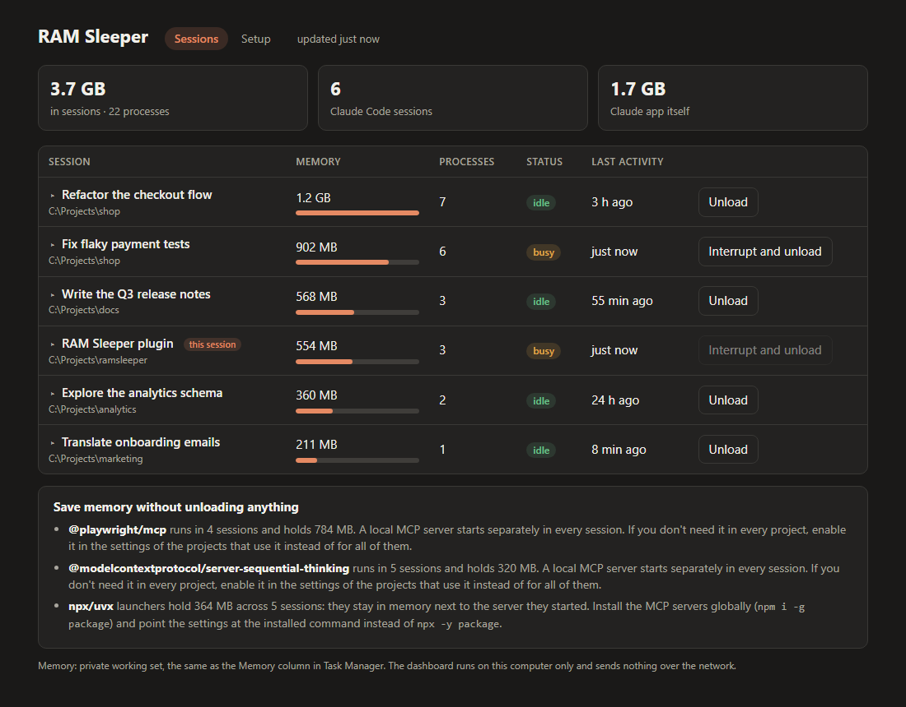
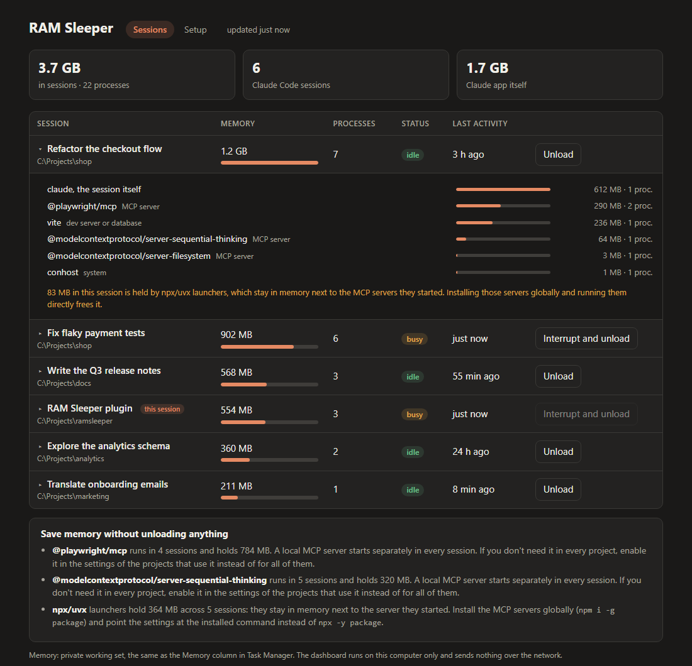
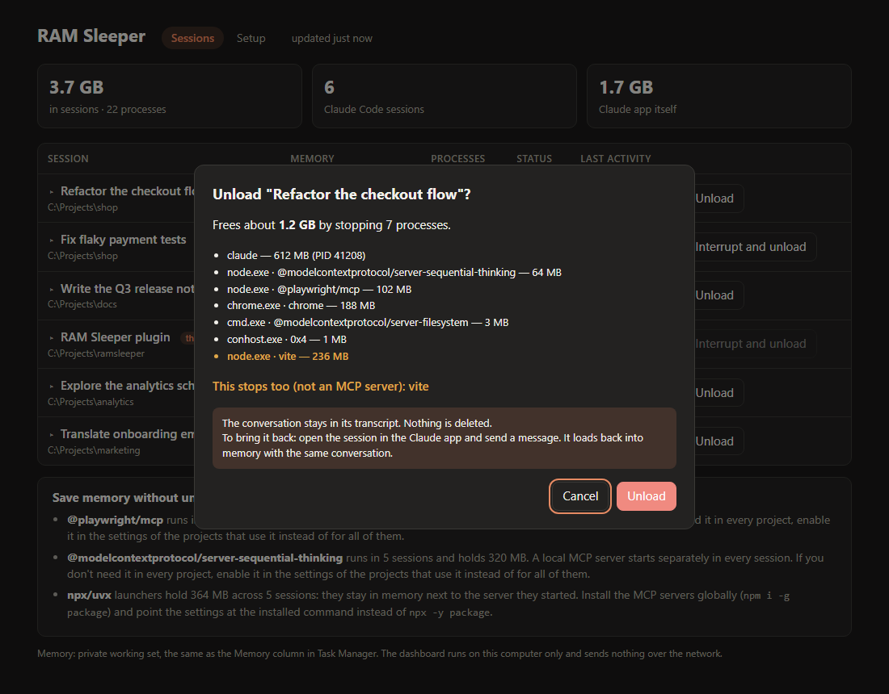
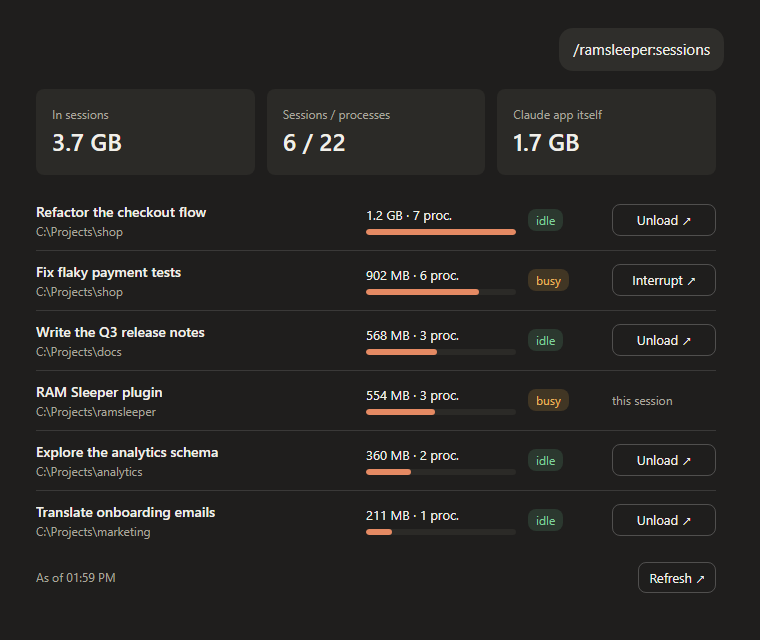
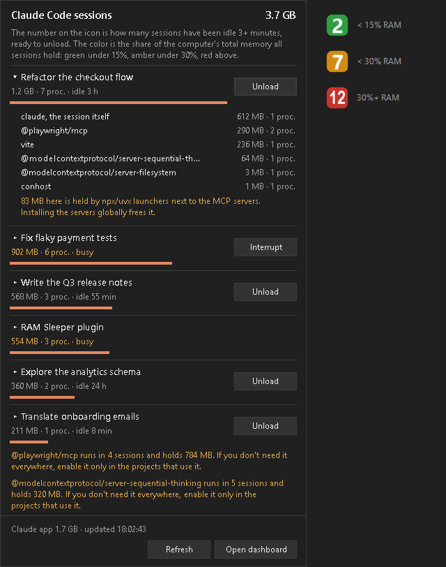
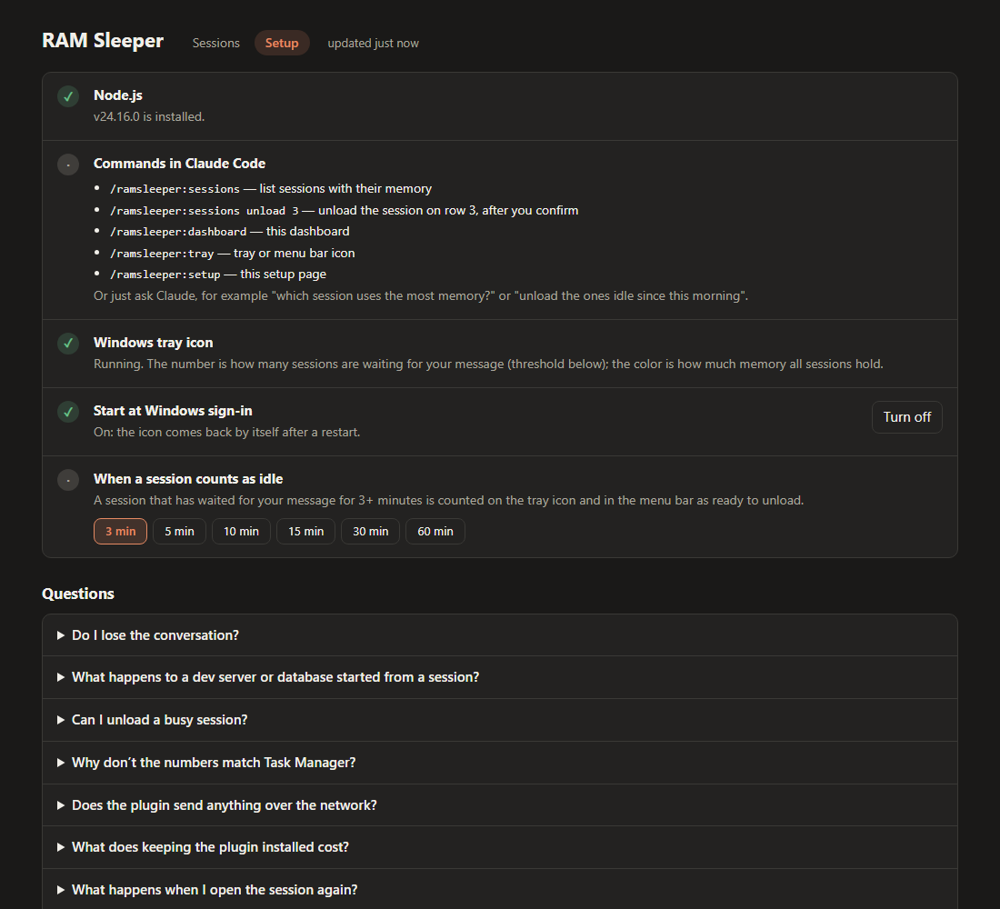

# RAM Sleeper

**See how much memory each Claude Code session uses, and put idle ones to sleep without losing them.**

Every Claude Code session is its own tree of processes: the `claude` process plus its MCP servers, shells, browsers, and dev servers. With several sessions open, for example in the Claude desktop app, that adds up to gigabytes, and idle sessions keep holding it. RAM Sleeper shows the memory of each session's whole tree and unloads the ones you pick. An unloaded session keeps its conversation. Open it again and it loads back into memory where you left off.



## Quick start

You need Claude Code and [Node.js](https://nodejs.org) 18 or newer on `PATH`. There are no npm dependencies.

1. **Install** from a terminal:
   ```
   claude plugin marketplace add kejid/ramsleeper
   claude plugin install ramsleeper@ramsleeper
   ```
2. **Restart** any Claude Code session that is already open. Plugins load when a session starts, and new sessions pick the plugin up on their own.
3. **Run `/ramsleeper:setup`** in any session. A local page opens. It checks Node.js, lists the commands, and on Windows starts the tray icon with one click.

After that, `/ramsleeper:sessions` shows where your memory goes. You can also ask Claude in plain words, for example "which Claude session uses the most memory?" or "unload the sessions I haven't touched today".

To try RAM Sleeper without installing it, start Claude Code with `claude --plugin-dir <path to this repository>`.

## What it does

- **Shows memory per session.** Each session's figure covers every process it started, and each session also shows its status (busy or idle) and last activity. The desktop app's own share is listed separately.
- **Shows what each session is made of.** Click a session to see the `claude` process itself and every MCP server it started, each with its memory. It also points out memory held by `npx` or `uvx` launchers, which stay running next to the server they started, about 60 MB each for npx.
- **Unloads without losing anything.** The session is asked to exit on its own, as if you pressed Ctrl+C, so the desktop app does not report a crash. The transcript stays on disk. Open the session, send a message, and it loads back into memory with the same conversation.
- **Handles stuck sessions.** A busy session can be interrupted and unloaded after a separate warning.
- **Always confirms first.** Nothing is stopped until you have seen exactly which processes will stop.

## Screenshots

All screenshots use demo data (`RAMSLEEPER_DEMO=1`), not real sessions.

### What a session is made of

Click a session in the dashboard or the tray to see where its memory goes: the `claude` process and each MCP server or dev server it started. If `npx` or `uvx` launchers are holding memory, it says how much.



### Tips that save memory without unloading

Under the list, RAM Sleeper points out two common sources of waste:

- **An MCP server that runs in many sessions.** A local (stdio) MCP server starts separately in every session, so a server enabled for all projects costs its memory once per open session. If you need it in only some projects, enable it in those projects' settings.
- **`npx` and `uvx` launchers.** `npx -y package` leaves the launcher running next to the server it started. Installing the server globally (`npm i -g package`) and pointing the MCP settings at the installed command removes that copy.

One server can also be shared by all sessions if it supports HTTP transport and you run it once as a local HTTP server. RAM Sleeper does not suggest this by itself: not every server supports it, and a shared server shares its state. For a browser server such as Playwright, that means the sessions would use the same browser.

### The confirmation

Every unload is confirmed first. The confirmation lists every process that will stop. It highlights anything that isn't an MCP server or a shell, such as a dev server, because that stops too:



### In the Claude desktop chat

`/ramsleeper:sessions` shows the list as a card in the chat. Its buttons ask Claude to unload a session, and Claude still confirms first. The picture is the plugin's real widget output, drawn outside the app:



### In a terminal

Without the desktop app, the same command prints a table:

```
#  Session                         RAM      Procs Status  Last activity  PID    ID
1  Refactor the checkout flow      1206 MB  7     idle    3 h ago        41208  0000a0f8
2  Fix flaky payment tests         902 MB   6     busy    just now       38112  000094e0
3  Write the Q3 release notes      568 MB   3     idle    55 min ago     29904  000074d0
4  RAM Sleeper plugin              554 MB   3     busy    just now       17444  00004424 ◀ this session

Total: 3801 MB in 22 processes across 6 sessions (private working set).
Claude desktop app itself: 1720 MB in 14 processes (never touched).
```

### The Windows tray icon

The number on the icon is how many sessions have been waiting for your message for 3 minutes or more, which are the ones worth unloading. The threshold can be set to 3, 5, 10, 15, 30, or 60 minutes on the setup page. The color shows what share of the computer's total RAM all sessions hold: by default green below 15 %, amber below 30 %, and red above. The setup page lets you move both cut-offs and shows what they mean in gigabytes on your machine. Hover over the icon for the exact figures, or click it for the list:



### Setup

`/ramsleeper:setup` checks the requirements, starts the tray, and answers common questions:



## Use it

| You want to | Do this |
|---|---|
| See which session uses the most memory | `/ramsleeper:sessions`, or just ask Claude |
| Unload a session | `/ramsleeper:sessions unload 3` (row 3 of the last list), or the Unload button in the dashboard or tray |
| Keep a live view open | `/ramsleeper:dashboard` |
| Get the tray icon (Windows) or the menu bar item (macOS, Linux) | `/ramsleeper:tray` |
| Bring an unloaded session back | Open it in the Claude app and send a message. In a terminal, run `claude --resume <session-id>` in its folder. |

### Safety rules

- The session you are talking to is never unloaded, and neither is the Claude desktop app itself.
- Only the processes shown in the confirmation are stopped. Before stopping anything, the plugin checks that each PID still belongs to the same process, by its start time, and to the session you confirmed, by its session ID. PIDs are reused, and Windows reuses them quickly.
- A session without a transcript on disk is refused, because it could not be resumed.
- A busy session is stopped only through the separate Interrupt and unload action. The running turn is cut off, and everything before it is kept.

## Platforms

| | Windows 10/11 | macOS | Linux |
|---|---|---|---|
| Session list and memory | ✅ tested | ⚠️ untested | 🧪 smoke test passes |
| Unload (graceful, then forced) | ✅ tested | ⚠️ untested | 🧪 smoke test passes |
| Resume in the Claude desktop app | ✅ tested | ⚠️ untested | not applicable |
| Dashboard | ✅ tested | ⚠️ untested | 🧪 smoke test passes |
| Tray or menu bar | ✅ tray icon | ⚠️ xbar or SwiftBar, untested | 🧪 menu output passes; ⚠️ Argos or Kargos and dialogs untested |

**✅ tested** on Windows 11 with Claude desktop 2.16120 and Claude Code 2.1.284 against real sessions. A session unloaded this way came back on its next message, with a new process resuming the same session ID and the whole conversation.

**🧪 smoke test passes** means `tests/smoke.mjs` passes on Debian 12 with Node 18 and Node 20 in Docker. The test uses fake sessions; nothing was tried on a Linux desktop with real Claude Code sessions. On Linux, `ps` must come from procps, which desktop distributions ship; BusyBox `ps` is not enough.

### Test log

Results for version 0.3.5, tested on 2026-09-30.

**Windows 11 Pro (build 26200), Claude desktop 2.16120, Claude Code 2.1.284, Node 24.16, real sessions:**

| Check | Result |
|---|---|
| Sessions matched to their desktop titles, process trees, and memory; figures consistent with Task Manager's private working set | ✅ |
| Real session unloaded, then reopened: it resumed the same session ID and still knew a code word it had been told before | ✅ |
| Graceful stop (console Ctrl+C) of a desktop session: no "Claude Code crashed" banner in the app | ✅ |
| Hard stop without the graceful step: the app shows "Claude Code crashed"; **Try again** resumes with the conversation intact | ✅ as expected |
| Refusals: this session, a busy session without `--force`, a wrong `--expect`, a row number, a too-short ID prefix | ✅ |
| Fake desktop session: stopped gracefully, child stopped, pid file removed | ✅ |
| Fake terminal session: no Ctrl+C sent, stopped by force, child stopped | ✅ |
| Busy fake session: preview shows the warning; unload needs `--force` | ✅ |
| Tray icon, popup, and start at sign-in; dashboard; setup page; chat widget, checked by hand | ✅ |

**Debian 12 in Docker, Node 18.20.8 and Node 20.20.2:** `tests/smoke.mjs` passes all 25 checks on both. The checks cover listing, stale pid files, children and memory, notable-process marking, the xbar menu, preview, refusals, graceful unload, `--force`, the dashboard and its token, and the menu bar script. Along the way the test found a real bug: exited sessions lingered as zombies and were reported as still running. That is fixed.

**macOS:** not tested.

**Known limit:** a busy session may treat Ctrl+C as "interrupt this turn" and keep running. After five seconds it is stopped by force, and the desktop app then shows the crash banner. The conversation is still intact.

### Help wanted: macOS and Linux testers

The macOS code has never run on a Mac, and the Linux code has only passed an automated test in a container. If you can try it, please open an issue with your OS and version and what happened for each of these:

1. `node tests/smoke.mjs` passes. It starts fake sessions in a temporary folder and never touches real ones; paste its output.
2. `node skills/ramsleeper/scripts/sessions.mjs list` shows your sessions with plausible memory figures.
3. `node skills/ramsleeper/scripts/sessions.mjs unload <pid>` previews the right processes. Run it with `--yes` on a throwaway session, then resume that session.
4. The menu bar item appears through xbar, SwiftBar, Argos, or Kargos (see below), and its Unload item asks for confirmation.
5. `/ramsleeper:dashboard` opens and refreshes.

`RAMSLEEPER_DEMO=1` shows made-up sessions, so you can check the interface without touching real ones.

## Tray and menu bar

**Windows:** run `/ramsleeper:tray`, or start it by hand:

```
powershell -NoProfile -STA -WindowStyle Hidden -ExecutionPolicy Bypass -File companion\windows-tray\ramsleeper-tray.ps1
```

Right-click the icon for the dashboard, start at sign-in, and exit.

**macOS and Linux:** install [xbar](https://xbarapp.com) or [SwiftBar](https://swiftbar.app) on macOS, [Argos](https://github.com/p-e-w/argos) on GNOME, or [Kargos](https://github.com/lipido/kargos) on KDE. Then link the plugin script into that app's plugin folder:

```
ln -s "<path to this repository>/companion/menubar/ramsleeper.30s.sh" "<plugin folder>/ramsleeper.30s.sh"
```

The setup page prints the exact command for the apps it finds. Unload asks for confirmation in a native dialog: `osascript` on macOS, `zenity` or `kdialog` on Linux.

## Troubleshooting

| Problem | What to do |
|---|---|
| The `/ramsleeper:…` commands don't appear | Restart the session: plugins load when a session starts. Check that `claude plugin list` shows `ramsleeper`. |
| "node is not recognized" or "command not found: node" | Install Node.js 18 or newer and restart the Claude app or terminal, so the new `PATH` is picked up. |
| The tray icon isn't visible | Windows may have put it behind the **^** arrow next to the clock. Drag it onto the taskbar to keep it in view. |
| The desktop app shows "Claude Code crashed" after an unload | The session didn't finish within five seconds of Ctrl+C and was stopped by force, which usually means it was busy. Nothing is lost: click **Try again** or send a message. |
| An unload is refused | Read the reason. It is either the session you are talking to, a session without a transcript, or a PID that changed owner since the list was shown. Refresh the list and try again. |

## Uninstall

1. Right-click the tray icon, turn off **Start at Windows sign-in**, and choose **Exit**. Or turn it off on the setup page.
2. Run `claude plugin uninstall ramsleeper@ramsleeper`.
3. Optionally, run `claude plugin marketplace remove ramsleeper`.

## How it works

Every running Claude Code process writes `~/.claude/sessions/<pid>.json` with its session ID, working folder, status, and start time. RAM Sleeper reads these files, then walks the operating system's process table to find each session's descendants and their memory. On Windows the figure is the private working set, the Memory column in Task Manager's Details tab. On macOS and Linux it is RSS, which counts shared memory more than once. Session titles come from the Claude desktop app's local session files or, for terminal sessions, from the first prompt in the transcript under `~/.claude/projects/`.

To unload, RAM Sleeper first asks the session to exit on its own. On macOS and Linux the session gets SIGINT. On Windows a short-lived helper attaches to the session's hidden console and raises Ctrl+C. It does this only for sessions of the desktop app, each of which has a console of its own. A terminal session shares your terminal's console, and Ctrl+C there would also reach your shell. Claude Code then shuts down cleanly, so the desktop app treats the exit as normal. After five seconds, anything from the confirmed list that is still the same process, going by its start time, is stopped by force: with `taskkill /F` on Windows, with SIGTERM and then SIGKILL elsewhere. A PID freed during shutdown and taken by another program is left alone. The transcript is never touched. The session's leftover file in `~/.claude/sessions` is removed, because a stopped process cannot remove it itself.

## Data

RAM Sleeper runs locally and sends nothing over the network. It reads these:

- `~/.claude/sessions`;
- transcript file names and first lines under `~/.claude/projects`;
- the Claude desktop app's session titles;
- the process list.

It writes these:

- The idle threshold and the icon color cut-offs you choose on the setup page are saved in `settings.json`, under `%LOCALAPPDATA%\ramsleeper\` on Windows and `~/.config/ramsleeper/` elsewhere. The `RAMSLEEPER_IDLE_MINUTES` environment variable overrides it.
- The Windows tray records its process ID in `%LOCALAPPDATA%\ramsleeper\tray.pid`.
- Turning on start at sign-in adds a `RAM Sleeper` shortcut to your Startup folder and a small launcher, `%LOCALAPPDATA%\ramsleeper\start-tray.ps1`, that starts the newest installed version. Turning it off removes both.

The dashboard is a web server bound to `127.0.0.1` only. Each run uses a new random one-time value (a nonce) that every request must carry, so neither other computers nor other websites open in your browser can use it. It stops 15 minutes after its page is closed.

## License

MIT, see [LICENSE](LICENSE). RAM Sleeper is an independent project and is not affiliated with Anthropic.
